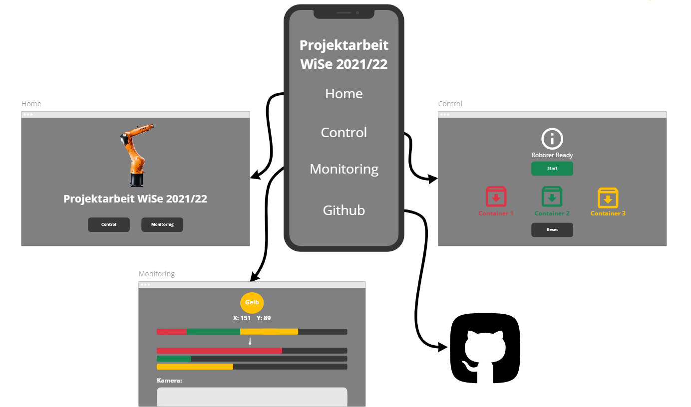

# Projektarbeit Wintersemester 2021/22
## Kuka Agilus KR6 Kugel Sotierroboter
Roboterarm zu sotieren von farbigen Kugeln mithilfe einer Kameraerkennungen.

# Aufbau:

Ursprüngliche Idee vom Aufbau. Datenbank wurde nicht umgesetzt, da ein Teammitglied im Verlaufe des Projekts das Team verlassen hat.

Grundsätzlich besteht der Quellcode dieses Projektes aus 3 Teilen:
- Kamera
- Roboter
- Webserver GUI

Dieser 3 Teile wurden mit einem jeweils in einem Thread umgesetzt, sodass sie gleichzeitig miteinander interagieren können. Allen Threads wurde eine **values object** und eine **SQL function** übergeben.

## Values:
Values is ein abgewandeldetes dictionary in Python. Dafür wurde die Bibliothek marvmiloTools verwendet. Details: https://github.com/marvmilo/marvmiloTools. Durch dieses Objekt können alle Threads gleichzeitig die gleichen Variablen auslesen und beschreiben. Ähnliche Funktion wie eine Pipe.
## SQL Function:
Durch die SQL Funktion können in der Datenbankdatei **database.db** standardmäßige SQLite3 befehle ausgeführt werden. Somit kann von jedem Thread die gleiche Datenbank beschrieben und ausgewertet werden.

# GUI
[@marvmilo](https://github.com/marvmilo) 

Die UI wurde als Webserver umgesetzt. Dieser wurde in Python mit der Bibliothek [Dash Plotly](https://plotly.com/dash/) programmiert unnd im Hochschulnetzwerk deployed.  
Aufbau:

## Webserver
In der Datei **./GUI/webserver.py** befindet sich das Grundgerüst der der UI. Hier wird der Dash Webserver initialisiert und gestartet. Desweiteren wird hier die grundsätzliche Vernetzung der Callbacks festeglegt.

## Callbacks
Die Datei **./GUI/callbacks.py** beinhaltet nun die genaue Definition der Callbacks. Zu jedem callback in **webserver.py** gibt es hier eine Funktion die bestimmt was zu tun ist wenn eine bestimmte ID auf dem Webserver getriggert wird.

## Layout
In dem Ordner **./GUI/layout** befinden sich mehrere Dateien mit dem Aufbau des Webserers:
- **\_\_init\_\_.py:**  
Hier wir die grundsätzlich Seitenstruktur definiert, sowie standart Seiten(z.B. 404 Not Found). Dazu gehört zum Beispiel die Navbar welcher auf jeder Seite die gleiche sein sollte. Genauso ist die allgemeine Struktur des Contents der Seite festgelegt. Hier sollten zudem alle IDs der Webapplikation zu finden sein für den initialen Aufruf der Callbacks.
- **home.py:**  
Aufbau der Home Seite.
- **control.py:**  
Aufbau der Control Seite, sowie layout Teile für Callbacks.
- **monitoring.py:**  
Aufbau der Monitoring Seite, sowie layout Teile für Callbacks.

## Debugging
Zum Debbugen des Webservers kann das Programm **GUI_debugger.py** ausgeführt werden. Dieser startet den Webserver auf Port **8050** und führt im Hintergrund die Datei **./GUI/debugger.py** welche die Aktionen und Outputs der Kamera und des Roboters simulliert.  
**ACHTUNG: Um den Debugger zu starten muss der Service der das Programm hosted gestoppt werden**

# Kamera
[@marvmilo](https://github.com/marvmilo) 

Kamera Steuerung und Auswertung.  
Die **./cam/\_\_init\_\_.py** beschreibt dabei den Ablauf. D.h. wann welche ein Bild mit der Kamera aufgenommen werden soll und wann dieses Bild wie ausgewertet werden soll. Dabei werden auch Werte und Indikatoren für ande Programmteile gesetzt und geändert.

## Auswertung:
In der Datei **./cam/hough.py** befinden sich verschiedene Funktion zum Auswerten des Kamera Bildes:
- **transformation:** Hier wird eine mathematische Hough Transformation angewant. Der Output ist eine Liste mit Mittelpunkten der Kugeln.
- **balls_to_collect:** Zählt anhand einer Liste mit Kugel Kordinaten, wieviele Kugeln insgesamt noch auf dem Tablet liegen und wieviele von jeder Farbe.
- **cordinates:** Wertet solang Kordinaten der Hough Transformation aus bis ein Output entstehr der vom Robot Script genutz werden kann um den Kuka Roboter anzusprechen.
- **save_location_image:** Speichert ein Bild in den **./assets** Ordner, welches dann von der GUI zum Monitoring verwendet wird.

# Roboter
[@lukeher](https://github.com/lukeher) 

Kommunikation zwischen Raspberry Pi und Kuka Roboter. Hier wird eine TCP Verbindung aufgebaut, indem der RPi einen TCP Server Initalisiert und der Roboter sich verbindet. Dann wird über das Protokol XML kommuniziert. Dabei schickt der RPi dem Roboter Befehle wie **movementclear** der z.B. aussagt, dass er das sotieren starten darf. Desweiteren werden natürlich auch Kordinaten und die Farbe gesendet, welche von der Kamera erkannt wurden. Der Roboter gibt immer bescheid wenn er außerhalb der Kamera Area ist und die aktuelle Kugel abgelegt wurde. Dann kann ein neues Bild augenommen werden.

# Weitere Dateien und Ordner:
## requirements.txt:
Dependencies des Scripts für Virual Enviroment.
## projektarbeit.service:
Konfigurationsdatei für den systemctl Service.
## values.json:
Initiale variablen des values Objekts bei start des Scriptes.
## kuka_roboter_programmierung:
Scripte die auf dem Kuka Roboter istalliert werden müssen.

