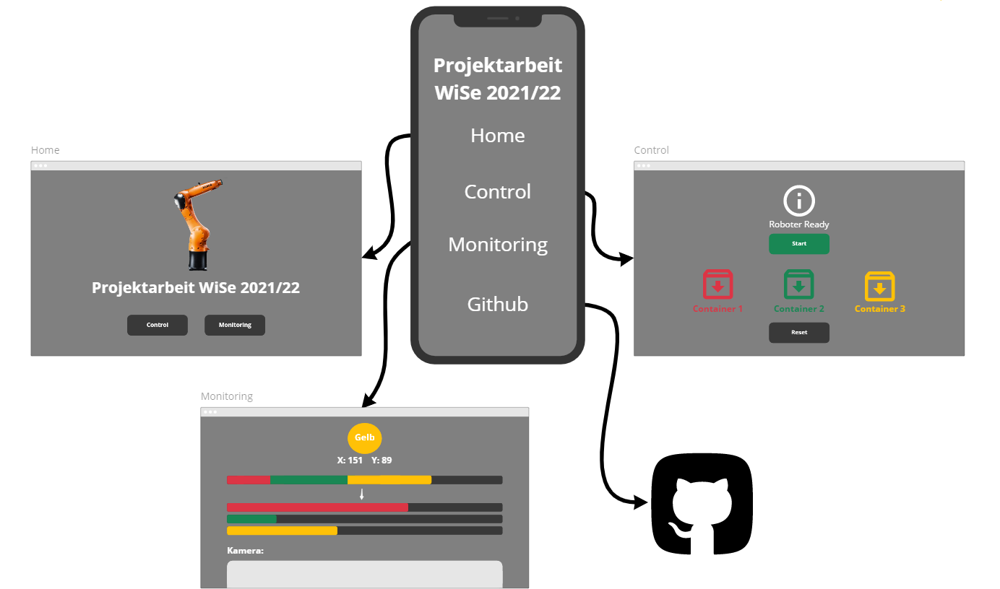

# Projektarbeit Wintersemester 2021/22
Kuka Murmel Sotieroboter.
# Aufbau:

# GUI
### Structure:

# Github Usage:
## Init lokales Repository
1. Install Git
1. Account auf Github erstellen: https://github.com/
1. Namen Marvin mitteilen um als Contributer zu adden
1. Workdir erstellen
1. Shell in workdir öffnen
1. ```git init```
1. ```git remote add origin https://github.com/marvmilo/projektarbeit_wise_2021-22```
1. ```git pull origin main```
1. Branch setzen: ```git checkout -b main```
## Updaten des Repositories
1. Update lokales Repository: ```git pull origin main```
1. Lokale Dateien zu Repository hinzufügen: ```git add .```
1. Änderung bestätigen mit Kommentar: ```git commit -m "kommentar"```
1. Ins öffentliche Repository pushen: ```git push origin main```
### Anmerkung:
- Beim ersten mal pushen Access Token erstellen: https://docs.github.com/en/authentication/keeping-your-account-and-data-secure/creating-a-personal-access-token#creating-a-token
- Vor dem ersten push: ```git config --global credential.helper store```
- Danach push ausführen, Username und Access Token eingeben: ```git push origin main```
- Änderungen können dann ohne Credentials gepushed werden
# Usage
Start Code in CWD:
- ```python .```
- ```python __main__.py```
### Debug Modes:
- **GUI:** ```python ./GUI_debugger.py```
# Tools:
### Static IP setzen:
- ```sudo nano /etc/dhcpcd.conf```
```
interface eth0
static ip_address=192.168.0.4/24
```
- ```sudo reboot now```
### Virtual Enviroment:
#### Erstellen:
```python -m venv env```
#### Aktivieren:
- Windows: ```env\Scripts\activate```
- Linux: ```source env/bin/actiatve```
#### Alle Packages installieren:
```pip install -r requirements.txt```
#### Aktuelle Packages hinzufügen:
```pip freeze > requirements.txt```
#### Aktuelle Packages im enviroment updaten:
```pip install -r requirements.txt --upgrade```
